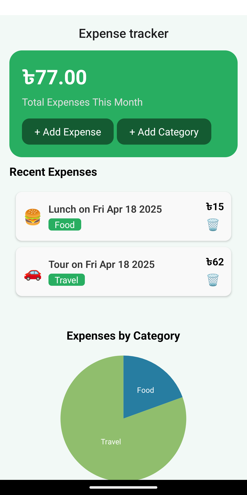
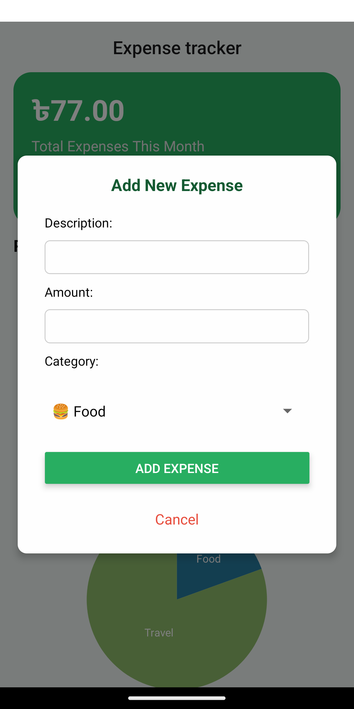
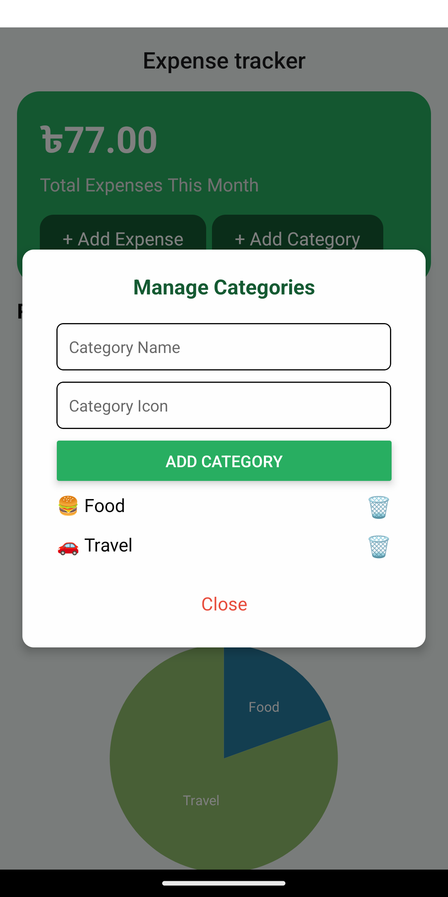

# 💰 Expense Tracker (React Native + OOP)

A mobile expense tracker built with **React Native**, focused on applying **JavaScript OOP concepts** with modern UI, persistent storage, and data visualization.

---

## ✨ Features

- 🔁 Built with **JavaScript OOP** principles
- 📊 Expense chart with `react-native-gifted-charts`
- 📂 Add & delete categories (2 demo categories included)
- 💾 Persistent data using `AsyncStorage`
- 📅 Show expenses by date
- 🔃 Custom `useStorage` hook
- 📱 Clean and user-friendly UI

---

## 💡 OOP Concepts Used

This project is designed to demonstrate real-world use of **Object-Oriented Programming (OOP)** in JavaScript within a React Native app.

- ✅ **Class**  
  The core logic is encapsulated inside the `ExpenseManager` class (`src/oop/ExpenseManager.js`).  
  It handles:
  - Adding, deleting, and filtering expenses
  - Managing categories
  - Business logic separation from UI

- ✅ **Encapsulation**  
  The internal logic (like how expenses are stored or processed) is hidden inside the class.  
  Components interact with the class via public methods like:
  - `addExpense()`
  - `deleteExpense()`
  - `filterExpensesByDate()`

- ✅ **Abstraction**  
  Components using `ExpenseManager` don’t need to know *how* data is stored or filtered — they just call methods and get results.  
  This makes the app more readable and easier to maintain.

- ✅ **Composition**  
  The app is built with **small, reusable components** (`ExpenseForm`, `ExpenseList`, `ExpenseChart`, etc.)  
  These components are composed together to build screens and enhance modularity.

- ✅ **Single Responsibility Principle (SRP)**  
  Each file/class/component does one job:
  - `ExpenseManager.js` → business logic  
  - `useStorage.js` → persistent data handling  
  - `ExpenseChart.js` → chart rendering  
  - `ExpenseForm.js` → input form for user data


---

## 🖼️ Screenshots

| Home Screen | Add Expenses | Add Categories |
|-------------|------------|------------|
|  |  |  |

---

## 🚀 Getting Started

```bash
git clone https://github.com/your-username/expense-tracker-oop.git
cd expense-tracker-oop
npm install
npx expo run:android (for android)
npx expo run:ios (for ios)

```

---

Made with ❤️ by Shakib


